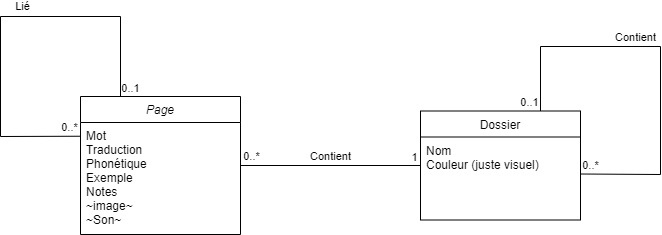

# wordies
Le but de cette application est d’aider les personnes voulant apprendre une langue à faire des listes de mots. 
Ces listes peuvent permettre de noter tous les mots que l’utilisateur connait déjà pour s’en rappeler ou au contraire peuvent lister les mots qu’il doit apprendre.

Le point intéressant est le fait d’avoir de pouvoir ranger chaque mot dans une catégorie que l’on créé soit même en tant qu’utilisateur, avec ces mêmes catégories qui peuvent être rangée dans d’autre catégorie, créant un système proche de celui des fichiers et répertoire Windows.
Le deuxième point fort et la liaison possible entre un mot et un autre. Dans une « page », qui n’est autre que la fenêtre pour UN mot précis, on peut trouver la ou les traductions littérales que l’on connait du mot mais aussi des exemples avec des phrases dans la langue en question. Chaque mot peut être des phrases d’exemple peuvent être lié à leur propre page si elle est déjà créée. Ainsi, si un jour l’utilisateur regarde les exemples d’utilisation d’un de ces mots mais a oublié ce que veut dire ce mot, alors il peut cliquer sur ce mot pour revoir sa traduction et/ou ses phrases d’exemple.

