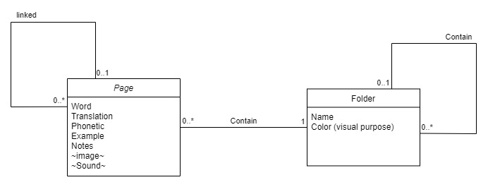

# wordies
Here is an app to help you list all the word that you already know in a language you learn. You can create categories to split up the words as you want.

The purpose of this application is to help people who want to learn a language to make lists of words.
These lists can make it possible to note all the words that the user already knows in order to remember them or, on the contrary, can list the words that he must learn.
The interesting point is the fact of having to be able to store each word in a category that one creates either even as a user, with these same categories which can be stored in another category, creating a system close to that Windows files and directories.
The second strong point is the possible connection between one word and another. In a “page”, which is none other than the window for ONE specific word, you can find the literal translation(s) that you know of the word but also examples with sentences in the language in question. Each word can be example sentences can be linked to their own page if it is already created. Thus, if one day the user looks at the examples of use of one of these words but has forgotten what this word means, then he can click on this word to review its translation and/or its example sentences.

